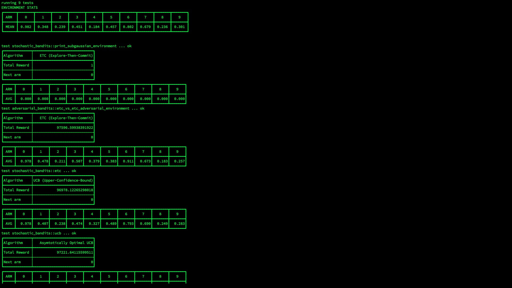

# Bandit
A small collection of Bandit algorithms, written in [Rust](https://www.rust-lang.org/)🦀.

This crate provides a generic framework for bandit protocol
and some bandit algorithms.
The algorithms are named & implemented
based on [this book](https://tor-lattimore.com/downloads/book/book.pdf).


# Test run
One can reproduce the following result by `cargo test -- --nocapture` command.



## How To Use
Write the following line to `Cargo.toml`.
```toml
bandit = { git = "https://github.com/rmitsuboshi/bandit" }
```

You can find code examples in `tests/small-tests.rs`.
I'll write some documents to every algorithms in this crate.


Currently, the following algorithms are implemented.
### Stochastic Bandits
- ETC (Explore-Then-Commit),
- UCB (Upper-Confidence-Bound),
- Asymptotically Optimal UCB (Asymptotically Optimal UCB),

### Adversarial Bandits
- Exp3 (Exponential-weight algorithm for Exploration and Exploitation)
- Exp3-IX (Exp3 + Implicit eXploration)


### Environments
- Sub-Gaussian environment,
- A worst-case environment for the ETC algorithm.
